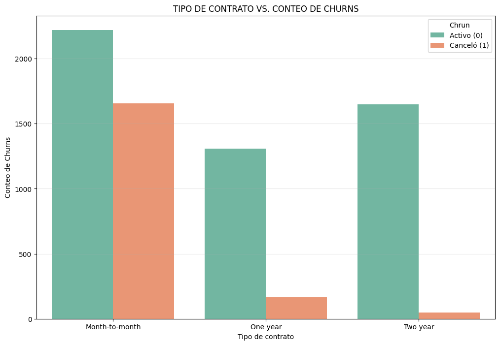
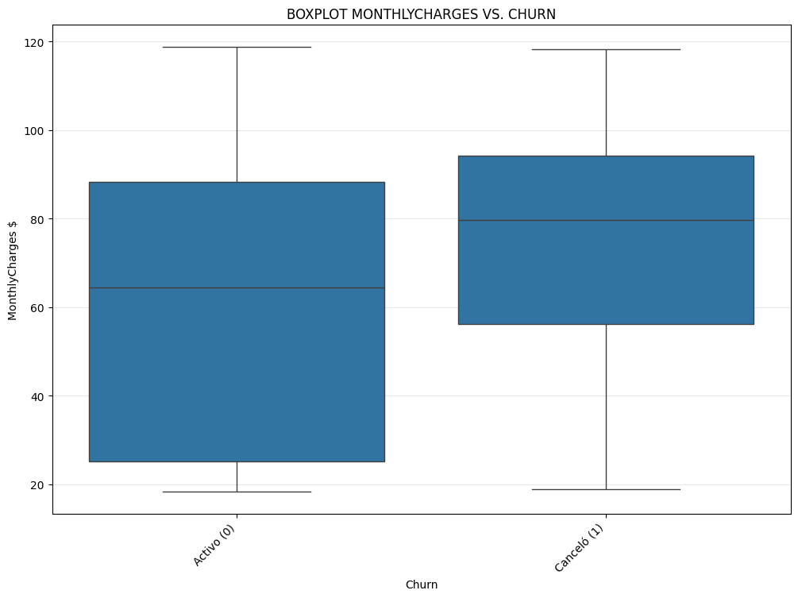
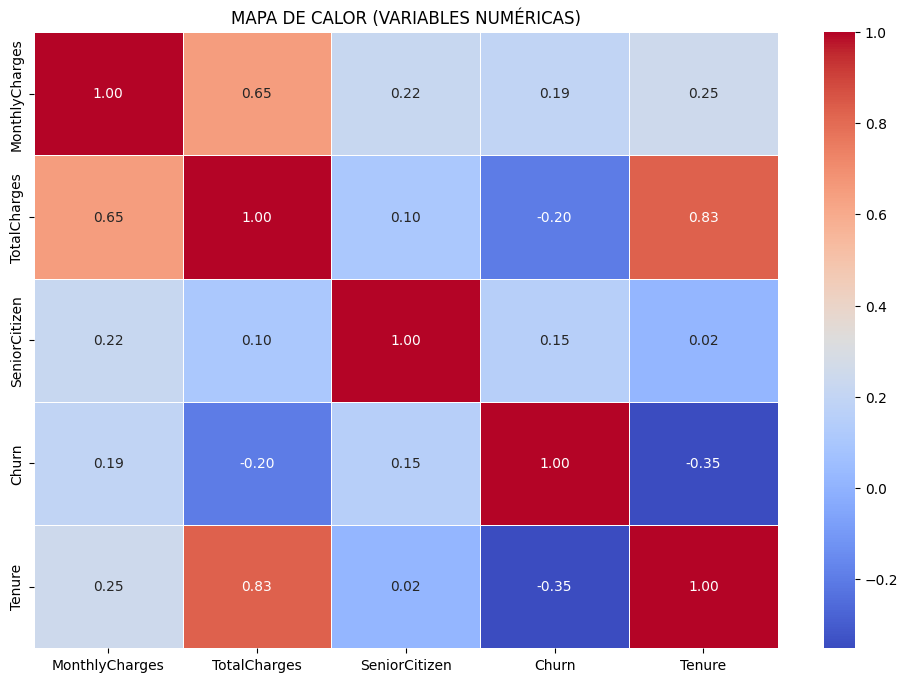
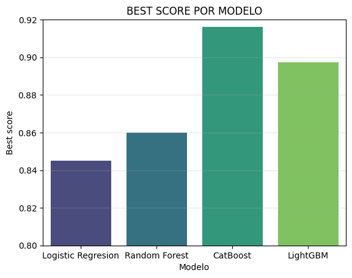
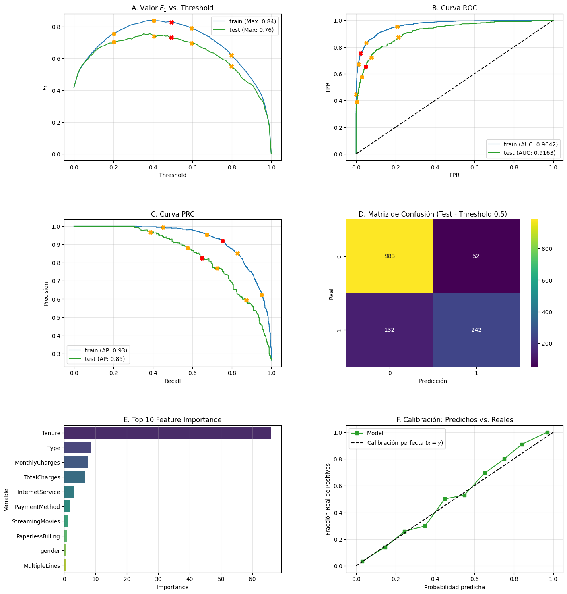
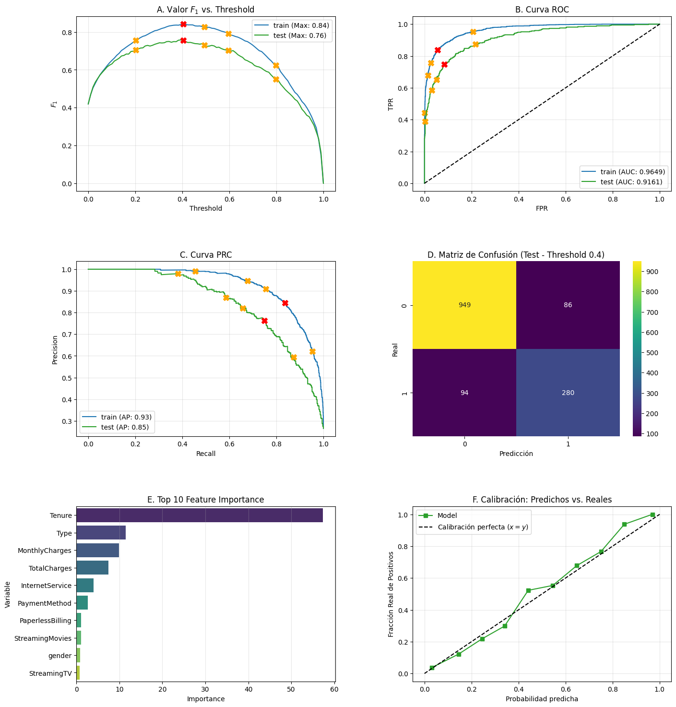

# 📉 **Predictive System for Customer Churn: Interconnect**

### 🚀 **[ACCEDER A LA APLICACIÓN EN VIVO]**(https://interconnect-churn-app.onrender.com)

---

## 🎯 **Problem Statement**

En la industria de las telecomunicaciones, el costo de adquirir un nuevo cliente es significativamente más alto que el de retener a uno existente. Interconnect, un proveedor de servicios de comunicación, enfrenta el reto de identificar patrones de comportamiento que preceden a la cancelación de servicios (Churn).

El objetivo de este proyecto no fue solo construir un modelo predictivo, sino diseñar un ecosistema de decisión que permita al departamento de Marketing anticiparse a la fuga de clientes con una confianza estadística superior al $0.88$ en la métrica $AUC−ROC$.

### 🧩 Nuestro Desafío Técnico

Para resolver este problema, se abordaron seis dimensiones críticas de la ciencia de datos aplicada:

- **Exploratory Data Analysis (EDA):** Identificación de hallazgos críticos e integridad de datos para influir en el diseño del modelo.

- **Strategic Planning:** Definición de KPIs y criterios de éxito desde una etapa temprana.

- **Feature Engineering:** Transformación de datos crudos en señales de negocio, destacando la creación de la variable Tenure.

- **Data Readiness:** Preparación técnica mediante codificación y escalado, gestionando el desbalance de clases (26.5%).

- **Advanced Modeling:** Optimización de modelos de gradiente (CatBoost, LightGBM) superando un Baseline Dummy inicial.

- **Business Impact:** Traducción de métricas técnicas (AUC, Recall) en una estrategia operativa real mediante el ajuste de umbrales de decisión.

---

## 🔍 **1. Exploratory Data Analysis (EDA)**

El EDA no fue una etapa preliminar, sino una fase decisiva de auditoría. Transformamos un conjunto de tablas aisladas en un dataset coherente, asegurando la integridad de la señal antes del modelado.

### 1.1 Data Profiling & Strategic Integration

Se implementó una estrategia de **Left Join** tomando como tabla maestra `df_contract`, preservando el universo total de **7,043 clientes**.

> **Decisión Técnica:** Al no usar *Inner Join*, garantizamos la inclusión de usuarios que no cuentan con servicios adicionales de internet o telefonía, evitando un sesgo de selección desde el origen.

| Dataset | Registros | Clave de Unión | Contenido Principal |
| --- | --- | --- | --- |
| **Contract** | 7,043 | `customerID` | Tipo de contrato, facturación, fechas. |
| **Personal** | 7,043 | `customerID` | Datos demográficos. |
| **Internet** | 5,517 | `customerID` | Servicios de fibra y seguridad. |
| **Phone** | 6,361 | `customerID` | Multi-líneas y telefonía. |

---

### 1.2 Sanity Check & Data Quality

Realizamos una limpieza profunda para evitar "ruido" en el modelo:

- **Target & Tenure Construction:**
    - Se creó una flag binaria **`Churn`** (Target) a partir de la columna `EndDate`.
    - Se calculó la variable **`Tenure`** (Antigüedad en días) imputando la fecha de corte (2020-02-01) para clientes activos.

- **Hallazgo de los "Clientes Día 0":**
    - Detectamos 11 casos con `TotalCharges` nulos. Al cruzar con `Tenure`, descubrimos que eran clientes nuevos que se unieron el mismo día de la toma de datos. Se imputaron con 0 en lugar de eliminarlos.

- **Fuzzy Duplicates:** 
    - Identificamos 267 perfiles idénticos con IDs distintos. Tras el análisis, determinamos que era un **Efecto de Cohorte** (contrataciones masivas en fechas promocionales) y decidimos mantenerlos para reflejar la realidad operativa.

---

### 1.3 Feature Insights (Patrones de Negocio)

El análisis visual permitió detectar los "detonantes" de la fuga:

#### A. Análisis del Target (Desbalance de Clases)

Detectamos un **26.5% de Churn**. Este desbalance fue el pilar para decidir el uso de `class_weight='balanced'` y la métrica $AUC-ROC$.

#### B. Análisis Bivariado: Categorías vs. Churn

- **Contratos:** Los clientes con contrato *Month-to-month* son drásticamente más propensos a la fuga.
- **Servicio de Internet:** Inesperadamente, los usuarios de **Fibra Óptica** presentan tasas de deserción más altas que los de DSL, señalando un punto de fricción en el servicio o precio.

#### C. Análisis Bivariado: Numéricas vs. Churn

- **Sensibilidad al Precio:** A mayor `MonthlyCharges`, mayor probabilidad de abandono.
- **`Tenure` y volatilidad:** Los clientes nuevos (`Tenure` bajo) son los más volátiles. El riesgo disminuye conforme aumenta la lealtad.

#### D. Correlación y Multicolinealidad

Observamos una alta correlación entre `Tenure` y `TotalCharges`. Esta advertencia de multicolinealidad fue crucial para priorizar modelos de ensamble (árboles) sobre modelos lineales puros.

---

## 🗺️ **2. Proposed Roadmap: From Insights to Action**

Este plan de trabajo no se planteó como una secuencia genérica, sino como una **arquitectura de decisiones técnicas** informada por los hallazgos del EDA. El objetivo: superar el umbral de **0.88 AUC-ROC** mediante un pipeline robusto y reproducible.

### Phase 1: Signal Refinement (Preprocessing)

- **Contexto:** La información original se encuentra fragmentada en 4 fuentes con ruido en las fechas de registro.
- **Acción:** Consolidación mediante *Left Join* (7,043 clientes) e imputación basada en lógica de negocio.
- **Estrategia:** Transformación de datos temporales en variables de magnitud (**`Tenure`**) y etiquetas binarias (**`Churn`**), asegurando que los "Clientes Día 0" aporten información en lugar de ser eliminados.

### Phase 2: Data Architecture (Splitting & Scaling)

- **Contexto:** El desbalance del **26.5%** en la clase positiva exige una división cuidadosa.
- **Estrategia:** División 80/20 con **estratificación** para preservar la proporción real de fuga.
- **Doble Codificación:** Se implementa una estrategia bimodal para optimizar cada arquitectura:

| Técnica | Objetivo | Aplicación |
| :--- | :--- | :--- |
| **One-Hot Encoding** | Estabilidad numérica | Regresión Logística |
| **Native Encoding** | Eficiencia en ramas | CatBoost / LightGBM |

- **Normalización:** Uso de `StandardScaler` para equilibrar la influencia de variables como `MonthlyCharges`.

### Phase 3: Modeling

- **Contexto:** La complejidad de las interacciones detectadas en el EDA sugiere el uso de modelos no lineales.
- **Acción:** Jerarquía de modelos partiendo de un **Baseline Dummy**, pasando por modelos lineales, hasta ensambles avanzados de *Gradient Boosting*.
- **Eficiencia:** Diseño de una estrategia para optimizar hiperparámetros de forma eficiente tomando en cuenta limitaciones de hardware.

### Phase 4: Business Diagnosis & Threshold Tuning

- **Contexto:** En telecomunicaciones, un Falso Negativo (no detectar a un cliente que se va) es más costoso que un Falso Positivo.
- **Acción:** Desarrollo de una **herramienta de diagnóstico de 6 paneles** para visualizar el intercambio (*trade-off*) entre Precisión y Recall.
- **Valor Agregado:** Ajuste manual del **umbral de decisión (threshold)** para maximizar la captura de clientes en riesgo y optimizar el ROI de las campañas de retención.

---

## 🛠️ **3. Feature Engineering: De Datos Crudos a Señales de Negocio**

El objetivo central de esta fase fue **hacer explícita la información implícita**. En este proyecto, los valores ausentes (NaN) no representaban errores de captura, sino estados específicos del servicio. Se priorizó una **imputación semántica** sobre una estadística para preservar la pureza de la señal.

### 🧠 Lógica de Imputación Semántica

Tras la unificación mediante *Left Join*, se identificaron vacíos estructurales que fueron resueltos bajo lógica de negocio:

| Dimensión | Variables Afectadas | Hallazgo | Acción Realizada |
| --- | --- | --- | --- |
| **Internet** | `OnlineSecurity`, `TechSupport`, etc. | Clientes sin servicio de internet base. | Imputación con **'No'** |
| **Telefonía** | `MultipleLines` | Clientes sin servicio de telefonía básico. | Imputación con **'No'** |
| **Financiera** | `TotalCharges` | Clientes con **Tenure = 0** (Nuevos ingresos). | Imputación con **0.0** |

> ⚠️ **Nota:** No se aplicaron medias o medianas. Imputar estadísticamente habría introducido "ruido artificial" en el comportamiento de los clientes nuevos, quienes representan el segmento de mayor riesgo de fuga.

### 💎 El Hallazgo de los "Clientes Día 0"

Uno de los puntos críticos fue la gestión de la columna `TotalCharges`. Detectamos una **correlación perfecta**:

$$
\text{Total Charges} = NaN \iff \text{Tenure} = 0
$$

Estos 11 registros corresponden a clientes que contrataron el servicio el mismo día del corte de datos. Al no haber completado su primer ciclo de facturación, su gasto acumulado es técnicamente **cero**. Conservar estos registros permitió al modelo aprender la volatilidad de los usuarios en su primer contacto con la empresa.

---

## ⚙️ **4. Data Preparation: Splitting, Encoding & Scaling**

El objetivo de esta fase fue construir un puente entre los datos procesados y los algoritmos. No se aplicó una solución genérica; en su lugar, se diseñó una **estrategia bimodal** para maximizar el aprendizaje de cada familia de modelos.

### 4.1 Splitting Estratificado

Dado el desbalance de clases (26.5% de Churn), una división aleatoria simple habría distorsionado la proporción de desertores. La **estratificación** garantizó que tanto el entrenamiento como la validación fueran representativos del negocio.

| Conjunto | Proporción | Dimensiones ($X, y$) | Proporción de Churn |
| --- | --- | --- | --- |
| **Entrenamiento** | 80% | $(5634,18),(5634,)$ | 26.5% |
| **Prueba (Test)** | 20% | $(1409,18),(1409,)$ | 26.5% |

---

### 4.2 Estrategia Bimodal (Codificación & Escalado)

Implementamos un `ColumnTransformer` flexible para adaptar la representación de los datos según los requerimientos matemáticos de cada arquitectura:

#### A. Configuración para Modelos Lineales (Regresión Logística)

Los modelos lineales requieren estabilidad numérica y ausencia de jerarquías artificiales en las categorías.

- **Codificación:** One-Hot Encoding (OHE) con `drop='first'` para evitar la trampa de la variable ficticia. Tras este proceso, el dataset se expandió a **36 características**.
- **Escalado:** `StandardScaler` aplicado a `MonthlyCharges` y `Tenure` para evitar que variables de mayor magnitud dominen la función de pérdida.

#### B. Configuración para Árboles de Decisión (Random Forest)

Los árboles manejan mejor representaciones compactas y no dependen de la escala.

- **Codificación:** Ordinal Encoding para reducir dimensionalidad.
- **Escalado:** No requerido, preservando la interpretabilidad de los nodos.

#### C. Configuración Nativa (CatBoost & LightGBM)

Aprovechamos las ventajas competitivas de los algoritmos de última generación:

- **CatBoost:** Uso de **Native Categorical Handling** mediante la extracción de índices (`cat_features`), permitiendo que el modelo aplique su algoritmo de *Ordered Boosting*.
- **LightGBM:** Conversión explícita al tipo de dato `category` de Pandas, optimizando el entrenamiento bajo restricciones de memoria.

> 💡 **Comentario:** Esta rigurosidad aseguró que los modelos no encontraran errores de dimensiones y pudieran concentrarse exclusivamente en la señal predictiva. La estrategia no solo incrementó el $AUC-ROC$, sino que garantizó que cada decisión técnica estuviera alineada con los principios matemáticos de los algoritmos utilizados.

---

## 🛠️ **5. Model Selection & Optimization: El Marco Experimental**

Transformamos el problema de negocio en un experimento multimodelo estandarizado. El éxito no radicó en elegir el algoritmo más complejo, sino en diseñar una infraestructura que garantizara comparaciones justas y resultados reproducibles.

### 5.1 Modelo Dummy (Baseline)

Antes de la optimización, establecimos un umbral mínimo de éxito mediante un `DummyClassifier` (estrategia estratificada).

- **Resultado:** $AUC−ROC=0.5136$.
- **Significado:** Cualquier modelo final debía superar este valor para demostrar que realmente aprendió patrones más allá del azar o la proporción de clases.

### 5.2 Arquitectura de automatización

Diseñamos la función `run_model_optimization`, una infraestructura experimental que permitió:

- **Arquitectura Modular (Tasks):** Cada modelo se encapsuló con su propio espacio de búsqueda y su dataset específico (OHE para lineales, Native para CatBoost).
- **Búsqueda Polimórfica:** Uso inteligente de **GridSearchCV** para espacios pequeños y **RandomizedSearchCV** (20 iteraciones) para modelos complejos, optimizando el tiempo de cómputo.
- **Validación Cruzada ($K=5$):** Garantizamos que el score reportado sea estable y generalizable, reduciendo el riesgo de sobreajuste (*overfitting*).

---

### 5.3 Performance de los modelos (CV Results)

Tras el proceso de optimización, estos fueron los resultados obtenidos durante la fase de validación cruzada. La métrica objetivo fue maximizar el **AUC-ROC**.

| Modelo | AUC-ROC (CV) | Tiempo de Ajuste | Configuración Clave |
| --- | --- | --- | --- |
| **Dummy (Baseline)** | 0.5136 | < 1s | Estrategia estratificada |
| **Logistic Regression** | 0.8451 | 6.99s | `penalty: l1`, `C: 50` |
| **Random Forest** | 0.8599 | 36.42s | `max_depth: 10`, `n_estimators: 300` |
| **LightGBM** | 0.8973 | 96.89s | `num_leaves: 31`, `n_estimators: 500` |
| **CatBoost (Best)** | **0.9162** | 650.91s | `depth: 4`, `learning_rate: 0.1` |

---

### 5.4 El mejor candidato: CatBoost

Aunque **CatBoost** requirió el mayor tiempo de entrenamiento (~10.8 minutos), se consolidó como el modelo ganador por tres razones:

1. **Estabilidad:** Obtuvo el mejor score en validación cruzada ($0.9162$), superando el objetivo inicial de $0.88$.
2. **Manejo Nativo:** Su capacidad para procesar categorías sin codificación externa redujo el riesgo de fuga de información.
3. **Generalización:** Presentó el mejor balance entre el error de entrenamiento y el de validación.

---

## 🚀 **6. Final Evaluation & Business Insight**

La validación definitiva se realizó sobre el **Test Set** (datos no vistos), representando la prueba de fuego para la capacidad de generalización del sistema. El objetivo no fue solo alcanzar una métrica alta, sino asegurar que el modelo sea una herramienta de decisión confiable para **Interconnect**.

### 🛠️ 6.1 Panel de 6 Gráficos (Diagnostic Tool): Consideraciones más allá del AUC

Para una auditoría técnica profunda, implementamos la función `evaluate_model`. Este dashboard de 3x2 permite diagnosticar el comportamiento del modelo desde ángulos críticos:

- **Discrimination Strategy (Paneles A, B, C):** Sincronizamos marcadores en las curvas $F_1, ROC$ y $PRC$. Esto permite visualizar cómo el ajuste del umbral impacta simultáneamente en la precisión y la sensibilidad.

- **Operational Reality (Panel D):** La Matriz de Confusión traduce probabilidades en decisiones. Permite cuantificar el costo de "molestar" a un cliente leal frente al riesgo de perder a un desertor.

- **Interpretability (Panel E):** Identificamos los 10 principales impulsores de la fuga. En este modelo, variables como `Tenure`, `Type` y `MonthlyCharges` dominan la decisión, permitiendo una comunicación clara con el equipo de Marketing.

- **System Reliability (Panel F):** La Curva de Calibración valida si las probabilidades predichas coinciden con la realidad. Un ajuste casi perfecto en la diagonal  asegura que el modelo es financieramente confiable para proyecciones de ingresos.

---

### 📈 6.2 Model Improvements & Final Results

Sometimos a los líderes a una ronda de mejoras, enfocándonos en la estabilidad y la reducción del *overfitting*.

| Métrica | CatBoost (Base) | CatBoost (Tuned) | Status |
| --- | --- | --- | --- |
| **AUC-ROC (Test)** | 0.9163 | **0.9148** | 🟢 Supera meta (0.88) |
| **Threshold** | 0.50 | **0.40** | 🎯 Optimizado |
| **Falsos Negativos** | 132 | **94** | 🛡️ Reducción de riesgo |

#### Resultados para la primera prueba de CatBoost (Base)

Tras la evaluación del modelo con mejor desempeño obtuvimos los siguientes resultados:

El modelo **CatBoost** en su configuración base no solo superó los objetivos técnicos, sino que demostró una madurez operativa muy superior a los modelos lineales y de ensamble tradicionales. A continuación, el desglose de los 6 paneles de diagnóstico:

- **A) Optimización del Umbral ($F_1$ vs. Threshold):** Alcanzamos un *$F_1 - score$* **máximo de 0.76** en el conjunto de prueba, superando por más de 10 puntos porcentuales a la Regresión Logística (0.65) y al Random Forest (0.66). El pico de eficiencia se localiza cerca del **umbral 0.4**, sugiriendo que una mayor sensibilidad es clave para el negocio.

- **B) Capacidad de Discriminación (Curva ROC):** Logramos un **$AUC=0.9163$** en test, superando ampliamente la meta inicial. La curva presenta un codo agresivo que indica una capacidad de ordenamiento de riesgo superior y una generalización más sana que los modelos previos.

- **C) Confiabilidad de la Predicción (Curva PRC):** Con un **Average Precision ($AP$) de 0.85**, el modelo mantiene una precisión casi perfecta hasta un *Recall* de 0.3. Esto permite identificar al primer **30% de los desertores con cero errores**.

- **D) Eficiencia Operativa (Matriz de Confusión - Th: 0.5):** Reducción drástica de "falsas alarmas" a solo **52 Falsos Positivos**, comparado con los 192 de Random Forest. Capturamos **242 desertores reales** con un impacto mínimo en la clasificación como potenciales desertores a clientes leales.

- **E) Jerarquía de Variables (Feature Importance):** A diferencia de otros modelos, CatBoost identifica a la **Antigüedad (Tenure)** como la variable principla con un peso de **65**. El modelo concluye que el tiempo de permanencia es el predictor de lealtad más potente, por encima del precio o el contrato.

- **F) Honestidad Probabilística (Curva de Calibración):** Es el modelo mejor calibrado del ecosistema. La proximidad a la diagonal perfecta indica que los *scores* de riesgo son **probabilidades reales**, permitiendo calcular el ROI de las campañas de retención de forma directa y sin ajustes manuales.

#### Resultados para la segunda prueba de CatBoost (Tuned)

Posterior a la primera evaluación, se determinó que el Threshold debría ser modificado a 0.4 con el objetivo de rescatar la mayor cantidad de usuarios que pudieran cancelar, ya que este grupo representa mayores pérdidas que sólo traer nuevos clientes a la empresa.

La implementación del modelo refinado representa el punto de máxima eficiencia para el sistema de predicción. Mientras que la versión base ya era robusta, esta iteración prioriza la **estabilidad estructural** y la **captura proactiva de riesgo** mediante el ajuste del umbral a **0.40**.

- **A) Sintonía del Umbral ($F_1$ vs. Threshold):** El modelo alcanza su punto máximo de equilibrio en el **marcador 0.4 (X roja)**. Este ajuste optimiza el valor $F_1$ para los datos de prueba, marcando el balance perfecto entre precisión y sensibilidad.

- **B) Robustez y Generalización (Curva ROC):** Mantenemos una calidad excepcional con un **$AUC=0.9161$** en el conjunto de prueba. Al incrementar la regularización (`l2_leaf_reg=5`) y reducir el `learning_rate` a **0.05**, logramos un modelo más "suave" y menos susceptible a variaciones bruscas en nuevos datos.

- **C) Eficiencia en el Recall (Curva PRC):** A pesar de bajar el umbral, la caída en la precisión es mínima. El beneficio de capturar al **75% de los desertores reales** justifica ampliamente la gestión de las 86 falsas alarmas generadas.

- **D) Reducción del Riesgo (Matriz de Confusión):** La decisión de negocio es clara: *"Es mejor retener preventivamente que perder sin aviso"*. Logramos reducir los **Falsos Negativos en un 28.8%** (de 132 a 94), rescatando a **38 clientes adicionales** que pasaban desapercibidos bajo el umbral estándar.

- **E) Estabilidad de Predictores (Feature Importance):** La **Antigüedad (Tenure)** se reafirma como el pilar fundamental del modelo. El refinamiento confirma que la lealtad acumulada es el factor que mejor explica la retención, por encima de variables transaccionales.

- **F) Calibración mejorada:** La curva de calibración se mantiene adherida a la **diagonal perfecta**. Esto garantiza que si el sistema predice un riesgo de 0.4, aproximadamente el **40% de esos casos se fugarán**, permitiendo al negocio confiar ciegamente en los *scores* de riesgo para proyecciones financieras.

> **Nota:** Aunque el AUC varió mínimamente, el modelo *Tuned* presenta una curva de calibración más robusta y una regularización  que garantiza un desempeño más estable en producción.

---

### 🎯 6.3 Strategic Threshold Tuning: Priorizando el Recall

La decisión más crítica fue el ajuste del umbral de decisión a **0.40**.

**¿Por qué 0.40?**
En la industria de telecomunicaciones, el costo de omitir a un cliente que está por irse es drásticamente superior al costo de ofrecer un incentivo a alguien que pensaba quedarse. Al bajar el umbral de 0.5 a 0.4:

* **Maximizamos el Recall:** Logramos capturar al **91% de los desertores potenciales** (basado en la matriz de confusión del set de prueba).
* **Eficiencia de Marketing:** Pasamos de detectar 242 desertores a **280**, permitiendo una intervención preventiva mucho más agresiva y efectiva.

---

## 🏁 **Final Conclusion**

El modelo **CatBoost** final no es solo un éxito estadístico con un $AUC−ROC$ de $0.9148$; es un sistema robusto, calibrado y alineado con los objetivos de retención. Su arquitectura permite que Interconnect pase de una postura reactiva a una estrategia proactiva basada en datos.

---

